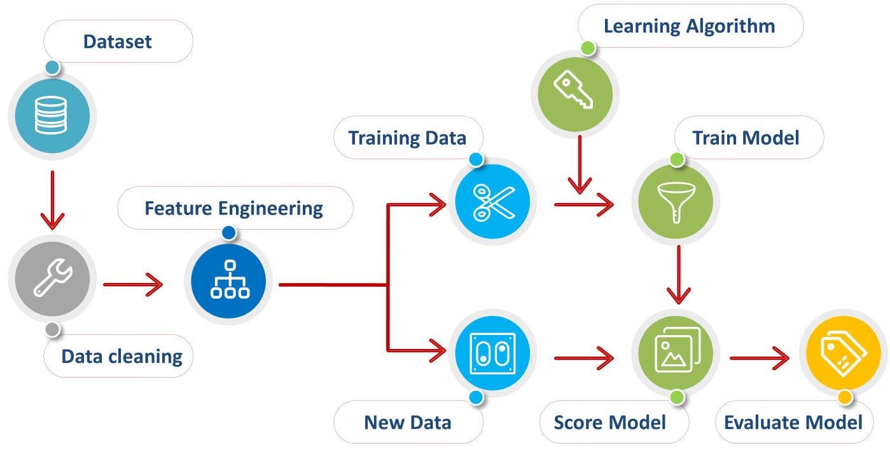
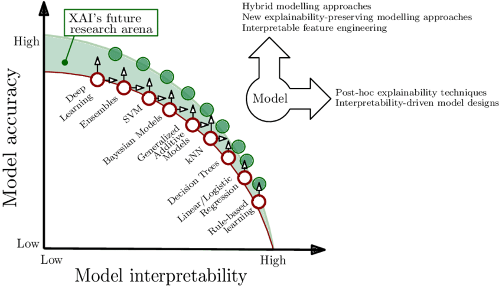

{
 "cells": [
  {
   "cell_type": "markdown",
   "metadata": {},
   "source": [
    "# ------------------------ MACHINE LEARNING ------------------------"
   ]
  },
  {
   "cell_type": "markdown",
   "metadata": {},
   "source": [
    ""
   ]
  },
  {
   "cell_type": "markdown",
   "metadata": {},
   "source": [
    "# 0. Gestion de projet"
   ]
  },
  {
   "cell_type": "markdown",
   "metadata": {},
   "source": [
    "## A. User Stories"
   ]
  },
  {
   "cell_type": "markdown",
   "metadata": {},
   "source": [
    "### Miro"
   ]
  },
  {
   "cell_type": "markdown",
   "metadata": {},
   "source": [
    "## B. Kanban"
   ]
  },
  {
   "cell_type": "markdown",
   "metadata": {},
   "source": [
    "Trello, Jira, Asana..."
   ]
  },
  {
   "cell_type": "markdown",
   "metadata": {},
   "source": [
    "## C. Diagramme de Gantt / Roadmap"
   ]
  },
  {
   "cell_type": "markdown",
   "metadata": {},
   "source": [
    "# I. Récupération de données"
   ]
  },
  {
   "cell_type": "markdown",
   "metadata": {},
   "source": [
    "## A. Scraping"
   ]
  },
  {
   "cell_type": "markdown",
   "metadata": {},
   "source": [
    "### 1. BeautifulSoup"
   ]
  },
  {
   "cell_type": "markdown",
   "metadata": {},
   "source": [
    "### 2. Scrapy"
   ]
  },
  {
   "cell_type": "markdown",
   "metadata": {},
   "source": [
    "### 3. Scrapy Splash"
   ]
  },
  {
   "cell_type": "markdown",
   "metadata": {},
   "source": [
    "### 4. Selenium"
   ]
  },
  {
   "cell_type": "markdown",
   "metadata": {},
   "source": [
    "## B. SQL - Bases de données relationnelles"
   ]
  },
  {
   "cell_type": "markdown",
   "metadata": {},
   "source": [
    "### 1. Langage SQL"
   ]
  },
  {
   "cell_type": "markdown",
   "metadata": {},
   "source": [
    "### 2. SQLite"
   ]
  },
  {
   "cell_type": "markdown",
   "metadata": {},
   "source": [
    "### 3. MySQL"
   ]
  },
  {
   "cell_type": "markdown",
   "metadata": {},
   "source": [
    "### 4. PostgreSQL"
   ]
  },
  {
   "cell_type": "markdown",
   "metadata": {},
   "source": [
    "## C. NoSQL - Bases de données non-relationnelles"
   ]
  },
  {
   "cell_type": "markdown",
   "metadata": {},
   "source": [
    "### 1. MongoDB et pymongo"
   ]
  },
  {
   "cell_type": "markdown",
   "metadata": {},
   "source": [
    "# II. Nettoyage des données"
   ]
  },
  {
   "cell_type": "markdown",
   "metadata": {},
   "source": [
    "## 0. Technologies"
   ]
  },
  {
   "cell_type": "markdown",
   "metadata": {},
   "source": [
    "### A. Numpy"
   ]
  },
  {
   "cell_type": "markdown",
   "metadata": {},
   "source": [
    "### B. Pandas"
   ]
  },
  {
   "cell_type": "markdown",
   "metadata": {},
   "source": [
    "### C. Dask"
   ]
  },
  {
   "cell_type": "markdown",
   "metadata": {},
   "source": [
    "### D. Numba"
   ]
  },
  {
   "cell_type": "markdown",
   "metadata": {},
   "source": [
    "## A. Sélection des données et renommage"
   ]
  },
  {
   "cell_type": "markdown",
   "metadata": {},
   "source": [
    "## B. Traitement des doublons"
   ]
  },
  {
   "cell_type": "markdown",
   "metadata": {},
   "source": [
    "## C. Traitement des valeurs manquantes"
   ]
  },
  {
   "cell_type": "markdown",
   "metadata": {},
   "source": [
    "## D. Traitement des types d'attribut"
   ]
  },
  {
   "cell_type": "markdown",
   "metadata": {},
   "source": [
    "## E. Consistance, reformatage, valeurs aberrantes"
   ]
  },
  {
   "cell_type": "markdown",
   "metadata": {},
   "source": [
    "# III. Exploration des données"
   ]
  },
  {
   "cell_type": "markdown",
   "metadata": {},
   "source": [
    "## 0. Technologies de visualisation"
   ]
  },
  {
   "cell_type": "markdown",
   "metadata": {},
   "source": [
    "### A. Matplotlib"
   ]
  },
  {
   "cell_type": "markdown",
   "metadata": {},
   "source": [
    "### B. Seaborn"
   ]
  },
  {
   "cell_type": "markdown",
   "metadata": {},
   "source": [
    "### C. Plotly"
   ]
  },
  {
   "cell_type": "markdown",
   "metadata": {},
   "source": [
    "### D. Cartopy"
   ]
  },
  {
   "cell_type": "markdown",
   "metadata": {},
   "source": [
    "### E. Bokeh"
   ]
  },
  {
   "cell_type": "markdown",
   "metadata": {},
   "source": [
    "## A. Analyse variables catégorielles et analyse variables quantitatives"
   ]
  },
  {
   "cell_type": "markdown",
   "metadata": {},
   "source": [
    "## B. Corrélations"
   ]
  },
  {
   "cell_type": "markdown",
   "metadata": {},
   "source": [
    "### 0. Tests statistiques"
   ]
  },
  {
   "cell_type": "markdown",
   "metadata": {},
   "source": [
    "### 1. Corrélations entre variables catégorielles"
   ]
  },
  {
   "cell_type": "markdown",
   "metadata": {},
   "source": [
    "### 2. Corrélations entre variables quantitatives"
   ]
  },
  {
   "cell_type": "markdown",
   "metadata": {},
   "source": [
    "### 3. Corrélations entre variables catégorielles et variables quantitatives"
   ]
  },
  {
   "cell_type": "markdown",
   "metadata": {},
   "source": [
    "# IV. Choix du modèle / Choix de la métrique"
   ]
  },
  {
   "cell_type": "markdown",
   "metadata": {},
   "source": [
    ""
   ]
  },
  {
   "cell_type": "markdown",
   "metadata": {},
   "source": [
    "- Scikit-Learn"
   ]
  },
  {
   "cell_type": "markdown",
   "metadata": {},
   "source": [
    "## A. Supervisé"
   ]
  },
  {
   "cell_type": "markdown",
   "metadata": {},
   "source": [
    "### 1. Régression"
   ]
  },
  {
   "cell_type": "markdown",
   "metadata": {},
   "source": [
    "- Régression Linéaire"
   ]
  },
  {
   "cell_type": "markdown",
   "metadata": {},
   "source": [
    "- Régression Logistique"
   ]
  },
  {
   "cell_type": "markdown",
   "metadata": {},
   "source": [
    "### 2. Classification"
   ]
  },
  {
   "cell_type": "markdown",
   "metadata": {},
   "source": [
    "- K-NN"
   ]
  },
  {
   "cell_type": "markdown",
   "metadata": {},
   "source": [
    "- RandomForest "
   ]
  },
  {
   "cell_type": "markdown",
   "metadata": {},
   "source": [
    "- XGBoost"
   ]
  },
  {
   "cell_type": "markdown",
   "metadata": {},
   "source": [
    "- SVM"
   ]
  },
  {
   "cell_type": "markdown",
   "metadata": {},
   "source": [
    "- NaiveBayes"
   ]
  },
  {
   "cell_type": "markdown",
   "metadata": {},
   "source": [
    "## B. Non-supervisé"
   ]
  },
  {
   "cell_type": "markdown",
   "metadata": {},
   "source": [
    "### 1. Réduction de la dimensionnalité"
   ]
  },
  {
   "cell_type": "markdown",
   "metadata": {},
   "source": [
    "### 2. Clustering / Regroupement"
   ]
  },
  {
   "cell_type": "markdown",
   "metadata": {},
   "source": [
    "## C. Renforcement"
   ]
  },
  {
   "cell_type": "markdown",
   "metadata": {},
   "source": [
    "## D. Régularisation"
   ]
  },
  {
   "cell_type": "markdown",
   "metadata": {},
   "source": [
    "## E. Bagging / Stacking / Boosting / Bootstraping"
   ]
  },
  {
   "cell_type": "markdown",
   "metadata": {},
   "source": [
    "## F. Deep Learning"
   ]
  },
  {
   "cell_type": "markdown",
   "metadata": {},
   "source": [
    "- PyTorch"
   ]
  },
  {
   "cell_type": "markdown",
   "metadata": {},
   "source": [
    "## G. Réseaux de neurones"
   ]
  },
  {
   "cell_type": "markdown",
   "metadata": {},
   "source": [
    "- TensorFlow\n",
    "- Keras"
   ]
  },
  {
   "cell_type": "markdown",
   "metadata": {},
   "source": [
    "# V. Preprocessing"
   ]
  },
  {
   "cell_type": "markdown",
   "metadata": {},
   "source": [
    "## A. Sélection des variables"
   ]
  },
  {
   "cell_type": "markdown",
   "metadata": {},
   "source": [
    "Nettoyer dataset des features redondantes qui ont une forte corrélation"
   ]
  },
  {
   "cell_type": "markdown",
   "metadata": {},
   "source": [
    "## B. Imputation"
   ]
  },
  {
   "cell_type": "markdown",
   "metadata": {},
   "source": [
    "- Pertinence de conserver ou supprimer des données\n",
    "- Supprimer anomalies\n",
    "- Assigner des valeurs par défaut aux valeurs manquantes"
   ]
  },
  {
   "cell_type": "markdown",
   "metadata": {},
   "source": [
    "## C. Encodage"
   ]
  },
  {
   "cell_type": "markdown",
   "metadata": {},
   "source": [
    "- LabelBinarizer\n",
    "- LabelEncoder\n",
    "- MultiLabelBinarizer\n",
    "- OneHotEncoder / get_dummies\n",
    "- OrdinalEncoder\n"
   ]
  },
  {
   "cell_type": "markdown",
   "metadata": {},
   "source": [
    "## D. Normalisation / Standardisation"
   ]
  },
  {
   "cell_type": "markdown",
   "metadata": {},
   "source": [
    ""
   ]
  },
  {
   "cell_type": "markdown",
   "metadata": {},
   "source": [
    "### 1. MinMaxScaler"
   ]
  },
  {
   "cell_type": "markdown",
   "metadata": {},
   "source": [
    "### 2. StandardScaler"
   ]
  },
  {
   "cell_type": "markdown",
   "metadata": {},
   "source": [
    "### 3. RobustScaler"
   ]
  },
  {
   "cell_type": "markdown",
   "metadata": {},
   "source": [
    "## E. Feature Engineering"
   ]
  },
  {
   "cell_type": "markdown",
   "metadata": {},
   "source": [
    "Création de nouvelles features"
   ]
  },
  {
   "cell_type": "markdown",
   "metadata": {},
   "source": [
    "## F. Pipeline"
   ]
  },
  {
   "cell_type": "markdown",
   "metadata": {},
   "source": [
    "# VI. Division jeu de données"
   ]
  },
  {
   "cell_type": "markdown",
   "metadata": {},
   "source": [
    "# VII. GridSearchCV & apprentissage"
   ]
  },
  {
   "cell_type": "markdown",
   "metadata": {},
   "source": [
    "Comparaison : MLFlow"
   ]
  },
  {
   "cell_type": "markdown",
   "metadata": {},
   "source": [
    "pycaret"
   ]
  },
  {
   "cell_type": "markdown",
   "metadata": {},
   "source": [
    "# VIII. Evaluation et interprétation"
   ]
  },
  {
   "cell_type": "markdown",
   "metadata": {},
   "source": [
    "## A. Comprendre et expliquer son modèle"
   ]
  },
  {
   "cell_type": "markdown",
   "metadata": {},
   "source": [
    ""
   ]
  },
  {
   "cell_type": "markdown",
   "metadata": {},
   "source": [
    "## B. SHAP"
   ]
  },
  {
   "cell_type": "markdown",
   "metadata": {},
   "source": [
    "#"
   ]
  },
  {
   "cell_type": "markdown",
   "metadata": {},
   "source": [
    "## C. PowerBI"
   ]
  },
  {
   "cell_type": "markdown",
   "metadata": {},
   "source": [
    "## D. Tableau"
   ]
  },
  {
   "cell_type": "markdown",
   "metadata": {},
   "source": [
    "# IX. Mise en production"
   ]
  },
  {
   "cell_type": "markdown",
   "metadata": {},
   "source": [
    "## A. Microsoft Azure"
   ]
  },
  {
   "cell_type": "markdown",
   "metadata": {},
   "source": [
    "AutoML"
   ]
  },
  {
   "cell_type": "markdown",
   "metadata": {},
   "source": [
    "## B. AWS - Amazon Web Services"
   ]
  },
  {
   "cell_type": "markdown",
   "metadata": {},
   "source": [
    "## C. Google Cloud Platform"
   ]
  },
  {
   "cell_type": "markdown",
   "metadata": {},
   "source": [
    "# X."
   ]
  },
  {
   "cell_type": "markdown",
   "metadata": {},
   "source": [
    ""
   ]
  },
  {
   "cell_type": "markdown",
   "metadata": {},
   "source": [
    "## A. ORM"
   ]
  },
  {
   "cell_type": "markdown",
   "metadata": {},
   "source": [
    "## B. Database Connector"
   ]
  },
  {
   "cell_type": "markdown",
   "metadata": {},
   "source": [
    "## C. Framework"
   ]
  },
  {
   "cell_type": "markdown",
   "metadata": {},
   "source": [
    "### 1. Streamlit"
   ]
  },
  {
   "cell_type": "markdown",
   "metadata": {},
   "source": [
    "### 2. FastAPI"
   ]
  },
  {
   "cell_type": "markdown",
   "metadata": {},
   "source": [
    "### 3. Django"
   ]
  },
  {
   "cell_type": "markdown",
   "metadata": {},
   "source": [
    "### 4. Flask"
   ]
  },
  {
   "cell_type": "markdown",
   "metadata": {},
   "source": [
    "## D. Hébergement"
   ]
  },
  {
   "cell_type": "markdown",
   "metadata": {},
   "source": [
    "### 1. Heroku"
   ]
  },
  {
   "cell_type": "markdown",
   "metadata": {},
   "source": [
    "### 2. Stockage : Hadoop & Spark"
   ]
  },
  {
   "cell_type": "markdown",
   "metadata": {},
   "source": [
    "### 3. BigQuery"
   ]
  },
  {
   "cell_type": "markdown",
   "metadata": {},
   "source": []
  }
 ],
 "metadata": {
  "interpreter": {
   "hash": "dd1cc886148b1d3dda72fea19e5fba9571a5a0d898d8fb89a58d1d381078e2c8"
  },
  "kernelspec": {
   "display_name": "Python 3.9.7 ('devia')",
   "language": "python",
   "name": "python3"
  },
  "language_info": {
   "name": "python",
   "version": "3.9.7"
  },
  "orig_nbformat": 4
 },
 "nbformat": 4,
 "nbformat_minor": 2
}
